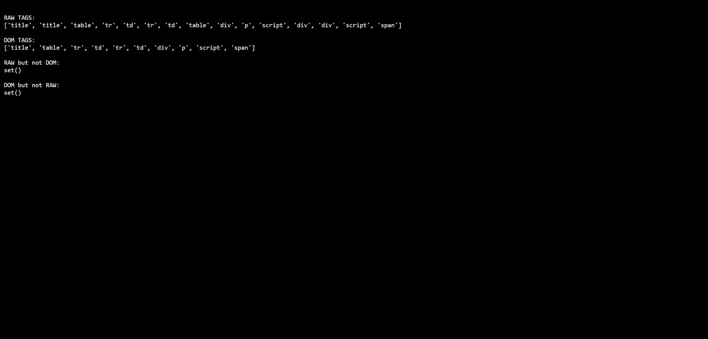

# html-parser-diff

> A differential analyzer that exposes where HTML source and the browser DOM disagree.

“You can’t regex HTML” is a famous rule of thumb.

This project doesn’t try to break that rule.  
It instruments the space between raw HTML signals and DOM structure to reveal how parsers silently normalize, repair, discard, and reinterpret markup.

## The Model

Raw HTML → Regex Signal Layer  
Parsed HTML → DOM Structure Layer  
Mediation → Reports where they disagree

## What this reveals

- Where text and DOM agree
- Where the DOM discards content (e.g. script/style handling)
- Where malformed HTML is normalized
- Where multiple raw signals map to a single DOM node
- Where the parser inserts nodes that never existed in the source

## Why this matters

The DOM is a lossy transformation of the original HTML.  
This tool makes the loss visible.

### Sample Output

## Example

See `examples/malformed.html`

This file is intentionally broken.  
Run it through the tool and compare:

- What exists in the raw source
- What exists in the DOM
- What the parser silently repaired or discarded

See `examples/expected-findings.txt` for what should be detected.

